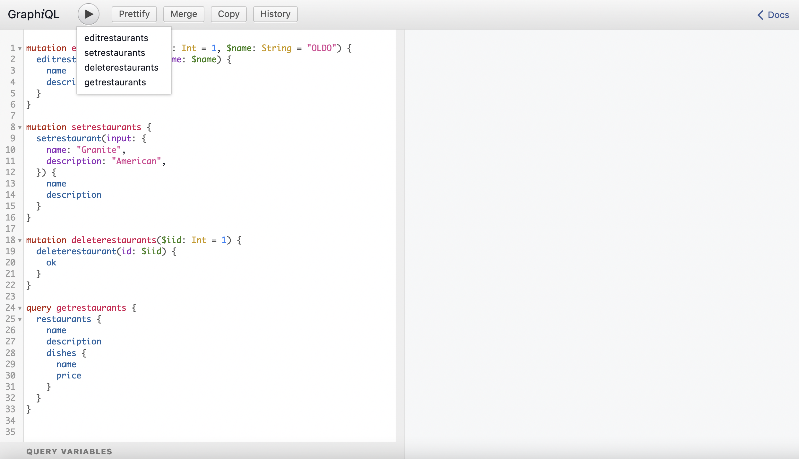

# GraphQL Restaurant Data Exercise
## Description
This project showcases how GraphQL can simplify building and maintaining APIs by offering a unified way to query and modify data, thus reducing the need for multiple REST endpoints. It provides a practical implementation for managing restaurant information with a flexible and efficient querying system.

## Features
- **Get Restaurant Information:** Users can query restaurant details, including their names, descriptions, and available dishes.
- **Add New Restaurant:** Users can add a new restaurant to the data collection via GraphQL mutation.
- **Edit Restaurant:** Users can update existing restaurant details such as name and description.
- **Delete Restaurant:** Users can remove a restaurant from the collection.

## Installation
1. Clone the repository: `git clone https://github.com/LucaBrizuela/GraphQL-Restaurant-Data-Exercise.git`
2. Navigate to the project directory: `cd GraphQL-Restaurant-Data-Exercise`
3. Install dependencies: `npm install`
4. Start the server: `npm start`

## Usage
1. Open your browser and go to `http://localhost:5500/graphql` to access the GraphiQL interface.
2. Use GraphQL queries to fetch restaurant data or individual restaurant information by ID.

- Example query:
   ```graphql
   {
     restaurants {
       id
       name
       description
       dishes {
         name
         price
       }
     }
   }
   
3. Use GraphQL mutations to add, edit, or delete restaurant data.

- Example mutation to add a restaurant:
     ```graphql
   mutation {
  setrestaurant(input: {name: "New Restaurant", description: "Test description"}) {
    name
    description
  }
  }

## Roadmap
### Version 2.0:
- Add user authentication to manage restaurant data access.
- Improve restaurant search functionality with filters and sorting options.
- Implement pagination for large datasets of restaurants.

### Version 3.0:
- Add integration with a real database for persistent restaurant data.
- Include more advanced features such as reviews and ratings for restaurants.
- Implement a more user-friendly frontend interface for non-technical users to interact with the data.


## License
This project is licensed under the MIT License. See the [LICENSE](https://github.com/LucaBrizuela/GraphQL-Restaurant-Data-Exercise/blob/main/LICENSE) file for details.

## Results

